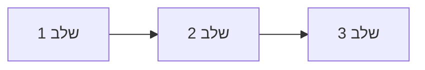

# <שם המשימה> — מסמך פתרון

**תאריך:** <YYYY-MM-DD> · **הוכן ע"י:** סוכן אופרציה · **סטטוס:** טיוטה לדיון

---

## סיכום מנהלים
> עד 5 שורות. הבעיה · ההמלצה · ההשפעה במספרים · מה צריך להחליט עכשיו.

## 1. המשימה והיעד
- **היעד העסקי:** <מה, למי, עד מתי>
- **North Star Metric:** <המדד האחד> — היום: <X> → יעד: <Y>

### הנחות עבודה
| הנחה | ערך | על מה מבוסס | איך לאמת |
|---|---|---|---|

## 2. התמונה המערכתית
### עץ המדדים
```
<North Star> = <רכיב א> × <רכיב ב> × <רכיב ג>
```
| רכיב | היום | Benchmark | יעד | בעלים |
|---|---|---|---|---|

### מה המחקר העלה
> שורה תחתונה במשפט אחד.
- <ממצא + מספר> [מקור 1]

## 3. אבחון
- **צוואר הבקבוק:** <השלב שמגביל את המערכת>
- **שורש הבעיה:** <5 Whys בקצרה>
- **שווי הפער:** <כמה כסף / זמן> [חישוב]

## 4. חלופות והמלצה
| חלופה | השפעה | מאמץ | עלות | זמן לתוצאה | סיכון |
|---|---|---|---|---|---|

**ההמלצה:** <חלופה> — כי <נימוק בשתי שורות>.

## 5. תהליך העבודה החדש

| # | שלב | מה קורה | אחראי | קלט → פלט | SLA | כלי / אוטומציה |
|---|---|---|---|---|---|---|

### RACI
| פעילות | R | A | C | I |
|---|---|---|---|---|

## 6. בנוי לסקייל
| נפח | מה נשבר | הפתרון | מתי (טריגר) |
|---|---|---|---|
| פי 3 | | | |
| פי 10 | | | |

## 7. הכלכלה
**נוסחאות:**
- עלות יישום = ...
- תועלת שנתית = ...
- ROI = (תועלת − עלות) ÷ עלות · נקודת איזון = עלות ÷ תועלת חודשית

| | שמרני | בסיס | אופטימי |
|---|---|---|---|
| עלות יישום | | | |
| תועלת שנתית | | | |
| ROI | | | |
| נקודת איזון (חודשים) | | | |

## 8. מדדי הצלחה (דשבורד)
| מדד | סוג | הגדרה / נוסחה | יעד | תדירות | בעלים |
|---|---|---|---|---|---|

## 9. תוכנית 30-60-90
| תקופה | מה עושים | תוצר | מדד הצלחה |
|---|---|---|---|
| ימים 1-14 (Quick Win) | | | |
| ימים 15-30 | | | |
| ימים 31-60 | | | |
| ימים 61-90 | | | |

## 10. סיכונים
| סיכון | הסתברות | השפעה | מה עושים |
|---|---|---|---|

## 11. מה צריך מכם
- <החלטה / משאב / נתון שנדרש, ממי ועד מתי>

## מקורות
1. <שם המקור>, <שנה> — <URL>
