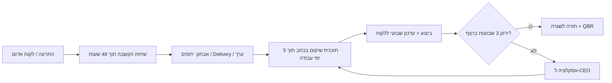

# Directeam: לקוחות בסיכון. מסמך פתרון

**תאריך:** 2026-10-03 · **הוכן ע"י:** סוכן אופרציה (ops-strategist) · **סטטוס:** טיוטה להצגה בראיון

---

## סיכום מנהלים
> **הבעיה:** 6 לקוחות בסיכון: 3 עם יחסים אישיים לא טובים, 2 עם תוצרים מתעכבים, ולקוח אחד גדול ומאוכזב. לפי ההנחות שלנו כ-₪1.2M רווח גולמי שנתי חשוף, וההפסד הצפוי בלי טיפול הוא כ-₪0.5M [חישוב].
> **האבחנה:** אלה לא 6 בעיות נפרדות. מאחוריהן 3 צווארי בקבוק משותפים: זמן המומחים הבכירים מוקצה בלי תעדוף, היחסים עם כל לקוח תלויים באדם אחד, ואין מערכת התרעה מוקדמת. הלקוח הגדול "הפתיע" אותנו.
> **ההמלצה:** "חדר מצב" ל-14 יום שמייצב את 6 הלקוחות לפי סדר ערך כספי. במקביל בונים מנגנון קל של ניטור לקוחות (Health Score שבועי ואסקלציה עם SLA), כדי שזה לא יחזור.
> **ההשפעה:** חיסכון צפוי של כ-₪300K בהפסד הצפוי בתרחיש בסיס, בעלות של כ-₪127K. ROI של כ-136% [חישוב].
> **ההחלטה שנדרשת עכשיו:** מעורבות ה-CEO בשיחה עם הלקוח הגדול תוך 48 שעות, והקצאת מהנדס בכיר ייעודי ל-30 יום.

## 1. המשימה והיעד
- **היעד העסקי:** תוכנית פעולה זריזה ל-90 יום שתעצור את הנטישה של 6 הלקוחות, תזהה את צווארי הבקבוק ותמנע הישנות.
- **North Star Metric:** **הכנסה משומרת (Gross Revenue Retention) של 6 הלקוחות בסיכון.** היום: לא ידוע, בסיכון. היעד: לפחות 90% מההכנסה שלהם נשמרת בעוד 90 יום [הנחה].

### על Directeam (מה שמשפיע על הפתרון)
- חברת שירותי ענן AWS ו-FinOps מרמת גן, הוקמה ב-2017. המוצר המרכזי הוא Sombrero Savings לחיסכון בעלויות EC2, ולצידו ייעוץ, הגירה, DevOps ו-Kubernetes [מקור 1][מקור 2].
- כ-23 עובדים מול "100+ לקוחות", כלומר יותר מ-4 לקוחות לכל עובד [מקור 3][חישוב]. **המשמעות:** זמן המומחים הוא המשאב הנדיר.
- הלקוחות הם בעיקר סטארטאפים וחברות טק בצמיחה [מקור 3]. הערך שהם קונים הוא **חיסכון בכסף ושקט תפעולי**, ולכן כל שיחת שימור צריכה להתבסס על מספרים.
- המודל העסקי, ככל הנראה, הוא הכנסה חוזרת דרך חשבון ה-AWS [הנחה, לא אומת]. כל לקוח שעוזב הוא הפסד חודשי מתמשך.

### הנחות עבודה
| הנחה | ערך | על מה מבוסס | איך לאמת |
|---|---|---|---|
| רווח גולמי שנתי ללקוח ממוצע | ₪120K | הערכה לפי גודל החברה ומודל הריסייל | דוח רווחיות לקוח מכספים |
| הלקוח הגדול | פי 5 מהממוצע, ₪600K | "מכניס הרבה כסף" | נתוני CRM |
| סיכוי נטישה בלי טיפול | גדול 50%, יחסים 35%, עיכוב 30% | נטישה ענפית של 10-25% בשנה [מקור 6], מוכפלת בגלל אות סיכון פעיל | היסטוריית נטישה פנימית |
| סיכוי נטישה עם התוכנית | גדול 20%, יחסים 15%, עיכוב 10% | טיפול מהיר משפר מאוד את סיכויי החזרה [מקור 8][מקור 9] | מדידה בפועל אחרי 90 יום |
| עלות שעת מהנדס בכיר / מנהל | כ-₪35K לחודש למשרה מלאה | שוק ישראלי | HR |

## 2. התמונה המערכתית
### עץ המדדים
```
הפסד צפוי = Σ (רווח שנתי של הלקוח × סיכוי נטישה)
סיכוי נטישה ← יחסים (אנשים) × Delivery (תהליך) × ערך נתפס (תוצאה)
```
| רכיב | מה מזיז אותו | איפה זה כואב היום | בעלים |
|---|---|---|---|
| יחסים | מספר אנשי קשר, תדירות מגע, התאמה אישית | 3 לקוחות | Account Manager |
| Delivery | זמינות מומחים, scope ברור, עדכוני סטטוס | 2 לקוחות | Tech Lead / CTO |
| ערך נתפס | הצגת חיסכון בפועל, מעורבות הנהלה | הלקוח הגדול | Head of CS / CEO |

| לקוחות בסיכון | מספר | רווח חשוף | סיכוי נטישה | הפסד צפוי |
|---|---|---|---|---|
| הלקוח הגדול | 1 | ₪600K | 50% | ₪300K |
| יחסים אישיים | 3 | ₪360K | 35% | ₪126K |
| תוצרים בעיכוב | 2 | ₪240K | 30% | ₪72K |
| **סה"כ** | **6** | **₪1.2M** | | **₪498K** [חישוב] |

### מה המחקר העלה
> שורה תחתונה: שימור זול בהרבה מרכישה, מהירות התגובה קובעת, ולקוח שתלוי באדם אחד הוא לקוח בסיכון.
- רכישת לקוח חדש יקרה פי 5 עד 25 משימור לקוח קיים [מקור 7]. עלייה של 5% בשימור מעלה את הרווח ב-25%-95% [מקור 10].
- בעיה גדולה שנפתרה מהר: 82% מהלקוחות קנו שוב [מקור 9]. עם זאת, "תיקון יפה" לבדו לא מבטיח נאמנות. צריך גם לשנות את מה שגרם לבעיה [מקור 8].
- כשאיש הקשר המרכזי (champion) עוזב, הסיכוי לנטישה תוך שנה הוא כ-51%, ופעולה בתוך 48 שעות משפרת את החידוש ב-33% [מקור 11, נתון של ספק].
- לקוחות B2B מחויבים לספק כמעט פי 3 יותר כשהם מרגישים **תועלת אישית**, לא רק תועלת טכנית [מקור 12]. לכן היחסים האישיים הם לא "רך", הם הכנסה.
- רק 73.4% מהפרויקטים בחברות שירותים מקצועיים מסתיימים בזמן [מקור 4]. 3 מ-5 הסיבות המובילות לכישלון קשורות לשינוי עדיפויות, יעדים ודרישות, כלומר ניהול scope [מקור 5].
- ניצולת מעל 80% מגבירה שחיקה ועזיבה. הטווח הבריא הוא 70-80% [מקור 13].

## 3. אבחון
**שורה תחתונה:** 6 סימפטומים, 3 גורמים, וצוואר בקבוק אחד.

| סימפטום | הגורם המשותף |
|---|---|
| 2 לקוחות עם עיכובים | **א. זמן המומחים** מוקצה למי שצועק הכי חזק, לא לפי ערך וסיכון. אין scope ו-Definition of Done ברורים. |
| 3 לקוחות עם יחסים לא טובים | **ב. יחסים חד-ערוציים:** כל לקוח תלוי באדם אחד, ואין "רשת ביטחון" כשהכימיה לא עובדת. |
| לקוח גדול שהתאכזב "לאחרונה" | **ג. אין התרעה מוקדמת:** גילינו את הבעיה כשהיא כבר אכזבה. אף אחד לא מדד בריאות לקוח. |

- **צוואר הבקבוק:** **זמן המומחים הבכירים**, שמוקצה בלי תעדוף ובלי נראות. זה המשאב שמגביל גם את ה-Delivery וגם את השירות ללקוח הגדול.
- **שורש הבעיה (5 Whys):** הלקוח התאכזב ← התוצר או השירות לא הגיעו כמצופה ← המומחה היה עמוס בלקוחות אחרים ← אין תעדוף לפי ערך ← **אין תמונה משותפת של מצב הלקוחות וסדרי העדיפויות**.
- **שווי הפער:** כ-₪0.5M הפסד צפוי [חישוב], שהם כ-4 לקוחות ממוצעים, וכל אחד מהם יקר פי 5-25 לגייס מחדש [מקור 7].

## 4. חלופות והמלצה
| חלופה | השפעה | מאמץ | עלות | זמן לתוצאה | סיכון |
|---|---|---|---|---|---|
| א. כיבוי שריפות: טיפול נקודתי בכל לקוח | בינונית | נמוך | נמוך | ימים | גבוה: יחזור שוב |
| **ב. חדר מצב ל-14 יום + מנגנון ניטור קל** | **גבוהה** | **בינוני** | **כ-₪127K** | **2-4 שבועות** | **נמוך-בינוני** |
| ג. ארגון מחדש: צוותי CS, כלי PSA וגיוס | גבוהה לטווח ארוך | גבוה | גבוה | 3-6 חודשים | הלקוחות יעזבו לפני שזה ישפיע |

**ההמלצה: חלופה ב.** היא מטפלת קודם בכסף שבסיכון כבר השבוע, ובמקביל בונה את המנגנון שמונע את הבעיה הבאה. רכיבים מחלופה ג' נכנסים בהדרגה בימים 61-90, רק כשהנפח מצדיק אותם.

## 5. תהליך העבודה החדש
### א. סדר הטיפול (Triage): לפי כסף × דחיפות
1. **הלקוח הגדול:** הכי הרבה כסף והכי הרבה רגש. **שעות 0-48.**
2. **2 לקוחות בעיכוב:** בעיה מוחשית שאפשר לפתור מהר, ומשם מגיע ה-Quick Win. **ימים 1-5.**
3. **3 לקוחות עם יחסים לא טובים:** דורשים אבחון עדין לפני פעולה. **ימים 3-10.**

### ב. פרוטוקול השיקום ללקוח

| # | שלב | מה קורה | אחראי | קלט → פלט | SLA | כלי |
|---|---|---|---|---|---|---|
| 1 | זיהוי | לקוח מסומן אדום ב-Health Score או בתלונה | Account Manager | אות סיכון → כרטיס לקוח בסיכון | תוך 24 שעות מהאות | CRM (HubSpot / Salesforce) |
| 2 | שיחת הקשבה | שיחה בלי פתרונות, רק להבין מה לא עבד ומה חשוב ללקוח | הבכיר המתאים (CEO ללקוח הגדול) | → 3 בעיות עיקריות במילים של הלקוח | תוך 48 שעות | פגישה |
| 3 | תוכנית שיקום | מה נתקן, מי, עד מתי, ואיך נמדוד. נשלחת ללקוח בכתב | Head of CS + Tech Lead | → מסמך עמוד אחד | תוך 5 ימי עבודה | תבנית |
| 4 | ביצוע | משימות בתוכנית ועדכון שבועי קבוע ללקוח | Tech Lead | → אבני דרך שהושלמו | עדכון כל שבוע | לוח משימות |
| 5 | סגירה | 3 שבועות ירוקים ברצף, ואחר כך QBR עם נתוני החיסכון בפועל | Account Manager | → לקוח ירוק + המלצה / הרחבה | 30-45 יום | מצגת QBR |

### ג. פעולות ספציפיות לכל קבוצה
- **הלקוח הגדול:** שיחה עם ה-CEO, מהנדס בכיר ייעודי ל-30 יום, ופגישת הנהלה שבועית. צריך להציג **מספרים**: כמה נחסך, מה תוקן, ומה ה-SLA החדש. כדאי לשקול פיצוי סמלי (קרדיט שירות), אבל רק בתוך תוכנית ולא במקומה [מקור 8].
- **התוצרים המתעכבים:** קובעים מחדש תאריכים עם הלקוח, תאריכים כנים ולא אופטימיים. מחלקים לאבני דרך קטנות, מספקים MVP קודם, נותנים עדכון סטטוס פעמיים בשבוע, ומכניסים תהליך Change Request לכל שינוי scope.
- **היחסים הלא טובים:** שואלים "האם זה האדם, התהליך או הציפייה?". מוסיפים איש קשר שני מצד Directeam ומצד הלקוח (multi-threading), ונערכת פגישה של מנהל עם מנהל. אם אין כימיה, **מחליפים Account Manager** בלי דרמה.

### RACI
| פעילות | אחראי לביצוע (R) | מאשר (A) | מתייעצים (C) | מעודכנים (I) |
|---|---|---|---|---|
| שיחה עם הלקוח הגדול | CEO | CEO | Head of CS, CTO | Account Manager |
| תוכנית שיקום | Head of CS | CEO | Tech Lead, AM | הצוות |
| תאריכי Delivery חדשים | Tech Lead | CTO | AM | הלקוח |
| החלפת / הוספת Account Manager | Head of CS | CEO | AM הנוכחי | הלקוח |
| עדכון Health Score שבועי | כל AM | Head of CS | Tech Lead | הנהלה |

### ד. השגרה שמונעת הישנות: 30 דקות בשבוע
**סקירת לקוחות שבועית.** כל לקוח מקבל רמזור לפי 5 שאלות. אחת או יותר אדומה = הלקוח אדום:
1. **Delivery:** האם יש תוצר באיחור?
2. **יחסים:** האם יש לנו קשר עם לפחות 2 אנשים אצל הלקוח? האם הייתה שיחה בשבועיים האחרונים?
3. **ערך:** האם הצגנו ללקוח את החיסכון בפועל ברבעון האחרון?
4. **שירות:** האם יש קריאה פתוחה מעל ה-SLA?
5. **תחושה:** האם ה-AM מרגיש שמשהו לא בסדר?

כל לקוח אדום נכנס לפרוטוקול השיקום. **תעדוף זמן המומחים** נקבע בסקירה הזו, לפי ערך × סיכון, ולא לפי מי שצועק.

## 6. בנוי לסקייל
| נפח | מה נשבר | הפתרון | מתי (טריגר) |
|---|---|---|---|
| היום (כ-100 לקוחות) | אין נראות | גיליון רמזור שבועי ידני | מיד |
| פי 3 (כ-300 לקוחות) | הסקירה הידנית לוקחת יותר מדי זמן | Health Score אוטומטי ב-CRM, מנתוני חיסכון, קריאות וחיוב. ידני רק לאדומים | כשהסקירה ארוכה מ-60 דקות |
| פי 10 (כ-1,000 לקוחות) | המומחים לא מספיקים לכולם | **רמות שירות:** high-touch ל-20% הגדולים, tech-touch (דוחות חיסכון אוטומטיים, self-serve) לקטנים. צוותי CS לפי רמה, וכלי PSA לניהול קיבולת | כשניצולת המומחים מעל 80% במשך חודש [מקור 13] |

## 7. הכלכלה
**נוסחאות:**
- הפסד צפוי = Σ רווח שנתי × סיכוי נטישה
- תועלת = הפסד צפוי בלי תוכנית − הפסד צפוי עם תוכנית
- עלות = זמן הנהלה + מהנדס ייעודי או קבלן + קרדיט פיצוי
- ROI = (תועלת − עלות) ÷ עלות

**עלות בתרחיש בסיס:** חצי משרה של הנהלה ל-3 חודשים, כ-₪52K. קבלן או מהנדס נוסף ל-2 חודשים, כ-₪60K. קרדיט ללקוח הגדול, כ-₪15K. **סה"כ כ-₪127K** [הנחה].
**תועלת בתרחיש בסיס:** ₪498K − ₪198K = **₪300K** [חישוב].

| | שמרני | בסיס | אופטימי |
|---|---|---|---|
| עלות יישום | ₪150K | ₪127K | ₪110K |
| תועלת (הפסד שנמנע) | ₪150K | ₪300K | ₪400K |
| ROI | 0% | 136% | 264% |
| נקודת איזון | 12 חודשים | כ-5 חודשים | כ-3.3 חודשים |

> גם בתרחיש השמרני התוכנית מחזירה את עצמה. בנוסף, המנגנון השבועי מגן על כל שאר ה-100+ לקוחות, וזה לא נכלל בחישוב.

## 8. מדדי הצלחה (דשבורד)
| מדד | סוג | הגדרה / נוסחה | יעד | תדירות | בעלים |
|---|---|---|---|---|---|
| זמן תגובה לאסקלציה | מוביל | שעות מהאות ועד שיחה עם הלקוח | 48 שעות לכל היותר | לכל אירוע | Head of CS |
| לקוחות עם תוכנית שיקום בכתב | מוביל | לקוחות אדומים עם תוכנית ÷ כל הלקוחות האדומים | 100% | שבועי | Head of CS |
| אבני דרך בזמן | מוביל | אבני דרך שהושלמו בזמן ÷ כל אבני הדרך | 90% לפחות (ממוצע ענפי 73% [מקור 4]) | שבועי | Tech Lead |
| כיסוי יחסים | מוביל | אחוז הלקוחות הגדולים עם 2 אנשי קשר או יותר | 100% ב-Top 20 | חודשי | AMs |
| מעבר מאדום לירוק | מוביל | מספר הלקוחות מתוך ה-6 שירוקים 3 שבועות ברצף | 4 מתוך 6 ביום 60 | שבועי | Head of CS |
| הכנסה משומרת (GRR) | תוצאה | הכנסה מהלקוחות הקיימים בסוף התקופה ÷ בתחילתה | 90% לפחות מה-6, ו-92% לפחות בחברה (ענפי: 85-95% [מקור 6]) | חודשי | CEO |
| NPS יחסים | תוצאה | סקר רבעוני לכל איש קשר | 33 לפחות (ממוצע טכנולוגיה B2B [מקור 14]) | רבעוני | Head of CS |

## 9. תוכנית 30-60-90
| תקופה | מה עושים | תוצר | מדד הצלחה |
|---|---|---|---|
| ימים 1-14 (Quick Win) | חדר מצב יומי של 15 דקות. שיחת CEO עם הלקוח הגדול. תאריכים חדשים ל-2 הלקוחות בעיכוב ואבן דרך ראשונה נמסרת. אבחון 3 הלקוחות עם יחסים בעייתיים | 6 תוכניות שיקום בכתב, אבן דרך אחת נמסרה | 100% מהלקוחות קיבלו מענה תוך 48 שעות |
| ימים 15-30 | סקירת לקוחות שבועית ורמזור לכל הלקוחות. תהליך Change Request. החלפה או הוספה של AM היכן שצריך | גיליון Health Score חי | 2 מתוך 6 ירוקים |
| ימים 31-60 | QBR עם נתוני חיסכון ל-Top 20. תעדוף מומחים לפי ערך × סיכון. Multi-threading ל-Top 20 | תבנית QBR ולוח קיבולת | 4 מתוך 6 ירוקים, 90% אבני דרך בזמן |
| ימים 61-90 | Health Score אוטומטי ב-CRM. NPS יחסים ראשון. החלטה על רמות שירות | דשבורד הנהלה | GRR של 90% לפחות מה-6 |

## 10. סיכונים
| סיכון | הסתברות | השפעה | מה עושים |
|---|---|---|---|
| הלקוח הגדול כבר החליט לעזוב | בינונית | גבוהה | מעורבות CEO מיידית ותוכנית עם מספרים. אם הוא עוזב, יציאה מסודרת שמשאירה דלת פתוחה ותחקיר |
| מומחה ייעודי ללקוח הגדול גורם לעיכוב אצל אחרים | גבוהה | בינונית | קבלן זמני ותעדוף שקוף בסקירה השבועית |
| ה-AM שיוחלף ייפגע | בינונית | בינונית | מציגים את זה כהתאמה ולא כעונש, ומעבירים אותו ללקוח אחר שמתאים לו |
| השגרה השבועית "תתמסמס" אחרי המשבר | גבוהה | גבוהה | 30 דקות קבועות ביומן, בעלים אחד, ודשבורד אוטומטי בימים 61-90 |
| ההנחות הכספיות לא מדויקות | גבוהה | נמוכה | התעדוף לא משתנה, והחישוב מתעדכן מנתוני CRM בשבוע הראשון |

## 11. מה צריך מכם
- **CEO:** שיחה עם הלקוח הגדול תוך 48 שעות, ופגישת הנהלה שבועית איתו למשך חודש.
- **CTO:** מהנדס בכיר ייעודי ל-30 יום ואישור לתקציב קבלן זמני (כ-₪60K).
- **כספים / CRM:** רווחיות לפי לקוח והיסטוריית נטישה, עד סוף השבוע הראשון.
- **כל ה-AMs:** 30 דקות בשבוע לסקירת לקוחות, מהשבוע הבא.

## מקורות
> הערה: גישת הקריאה המלאה (WebFetch) נחסמה בסביבת המחקר. המספרים אומתו מול תקצירי החיפוש בלבד. כדאי לפתוח את הקישורים לפני שמצטטים אותם בראיון.

1. AWS APN Blog, תגית Directeam — https://aws.amazon.com/blogs/apn/tag/directeam/
2. CB Insights, Directeam — https://www.cbinsights.com/company/directeam/
3. Built In NYC, Directeam (גודל ולקוחות) — https://www.builtinnyc.com/company/directeam
4. SPI Research, ‏18th PS Maturity Benchmark, ‏2024 — https://spiresearch.com/the-18th-annual-professional-services-maturity-benchmark-report-is-out-now/
5. PMI, Pulse of the Profession — https://www.pmi.org/learning/thought-leadership/pulse/core-competency-project-program-success
6. Pedowitz Group, Churn benchmarks by industry (יועצים) — https://www.pedowitzgroup.com/what-benchmarks-exist-for-churn-by-industry
7. Gallo, HBR, ‏2014 — https://hbr.org/2014/10/the-value-of-keeping-the-right-customers
8. de Matos et al., Journal of Service Research, ‏2007 — https://doi.org/10.1177/1094670507303012
9. TARP / Goodman, דרך CS Monitor, ‏2000 (מחקר צרכני ישן) — https://csmonitor.com/2000/0717/p12s1.html
10. Reichheld & Detrick, Bain, ‏2003 — https://media.bain.com/Images/MM_Loyalty_prescription_cutting_costs.pdf
11. ChurnZero (ספק, SaaS) — https://churnzero.com/blog/churn-monster-championless/
12. Gartner, ‏2024 — https://www.gartner.com/en/documents/5328063
13. SPI Research, The Truth About Billable Utilization — https://spiresearch.com/the-truth-about-billable-utilization/
14. ITSMA, NPS Benchmarks, ‏2019 — https://www.itsma.com/nps-benchmarks-are-you-delivering-a-truly-great-experience/
